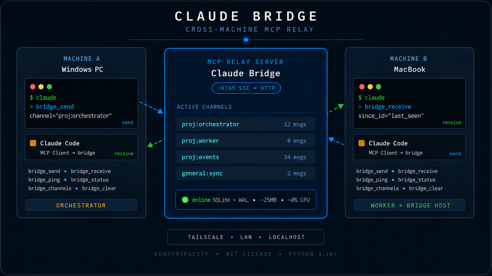

# Claude Bridge

**Real-time cross-machine communication for Claude Code agents.**


---

Claude Code's native [Agent Teams](https://code.claude.com/docs/en/agent-teams) coordinate multiple instances on the **same machine**. Claude Bridge fills the gap — it lets Claude Code agents on **different machines** communicate in real time over a shared MCP relay server.

```
Windows PC (Claude Code)         MacBook (Claude Code)
         |                                |
         |   SSE · Tailscale / LAN        |  ← server runs here
         +-------> Claude Bridge <--------+
                    :8765
```

One agent sends. The other receives. No polling hacks, no shared filesystems, no cloud dependencies.

---

## Architecture



---

## Quickstart

### 1. Install (on the machine that will host the server)

```bash
pip install claude-code-bridge          # server + web dashboard
pip install claude-code-bridge[tui]     # also brings the terminal UI
```

> **Why the PyPI name differs from the project name:** `claude-bridge` was already taken on PyPI by an unrelated project. The distribution name is `claude-code-bridge`; the import name (`import claude_bridge`) and the CLI command (`claude-bridge`) are unchanged.

Or from a clone if you'd like to hack on it:
```bash
git clone https://github.com/constripacity/Claude-Bridge.git
cd Claude-Bridge
pip install -e .[dev]              # editable install with test/lint deps
```

### 2. Start the server

```bash
claude-bridge                       # defaults: 0.0.0.0:8765, ./claude-bridge.db
# or pick a custom port / db path:
claude-bridge --port 9000 --db /var/lib/claude-bridge/bridge.db
# or disable the web dashboard if you only want the MCP transport:
claude-bridge --no-dashboard
# or run as a pure stdio MCP server (no HTTP, no dashboard, no banner):
claude-bridge --stdio
```

```
━━━━━━━━━━━━━━━━━━━━━━━━━━━━━━━━━━━━━━━━━━━━━━━━━
  Claude Bridge — General MCP Relay Server
  Version: 0.6.0
  http://localhost:8765/             ← Dashboard
  http://localhost:8765/sse          ← Local MCP config
  http://<host-address>:8765/sse    ← Remote machines (LAN/Tailscale)
  http://localhost:8765/api/state    ← JSON state for dashboard
  http://localhost:8765/status       ← Health check
━━━━━━━━━━━━━━━━━━━━━━━━━━━━━━━━━━━━━━━━━━━━━━━━━
```

### 3. Connect each Claude Code session to the bridge

Use the `claude mcp add` CLI on every machine that should use the bridge — including the host. Don't edit `~/.claude/settings.json` directly; current Claude Code rejects the legacy `mcpServers` block at the schema level.

**Host machine** — points at the local server:
```bash
claude mcp add --transport sse -s user claude-bridge http://localhost:8765/sse
```

**Remote machines** — point at the host's reachable address (LAN IP, Tailscale IP, or any other network route):
```bash
claude mcp add --transport sse -s user claude-bridge http://<host-address>:8765/sse
```

**Single-machine / stdio mode** — when there's no need for cross-machine reach, Claude Code can spawn the bridge as a subprocess and talk to it over stdin/stdout, no HTTP at all:
```bash
claude mcp add -s user claude-bridge -- claude-bridge --stdio
# share the SQLite store with an HTTP instance if you also run one:
claude mcp add -s user claude-bridge -- claude-bridge --stdio --db /path/to/shared.db
```

Use `-s user` to share the entry across all your projects, or `-s local` to scope it to one. Verify with `claude mcp list` — `claude-bridge` should show as `✓ Connected`. If a Claude Code session is already running, type `/mcp` inside it to re-handshake (or restart the session) so the new tools register.

That's it. Every connected Claude Code session now has six new tools.

---

## MCP Tools

| Tool | Description |
|------|-------------|
| `bridge_send` | Send a message to a named channel |
| `bridge_receive` | Read messages — pass `since_id` for incremental polling |
| `bridge_channels` | List all active channels and message counts |
| `bridge_ping` | Health check + server stats |
| `bridge_clear` | Clear all messages from a channel |
| `bridge_status` | Cross-channel overview with recent messages |

---

## Usage

Agents communicate over **named channels**. Convention: `<project>:<role>`.

**Machine A (orchestrator):**
```
bridge_send(
  channel="myproject:orchestrator",
  sender="windows",
  content='{"type":"task","phase":1,"action":"run_tests"}'
)
```

**Machine B (worker):**
```
bridge_receive(channel="myproject:orchestrator")
→ gets the task

bridge_send(
  channel="myproject:worker",
  sender="mac",
  content='{"type":"result","phase":1,"status":"complete","tests_run":61,"failures":0}'
)
```

**Machine A polls for results:**
```
bridge_receive(channel="myproject:worker", since_id="<last_id>")
```

The `since_id` parameter ensures each agent only processes new messages on every poll.

---

## Channel Naming

Channels are created on first write — no registration needed.

```
<project>:orchestrator   →  A sends tasks to B
<project>:worker         →  B sends results to A
<project>:events         →  shared event log
<project>:debug          →  verbose diagnostics
general:sync             →  cross-project coordination
```

---

## Networking

The bridge is plain HTTP + Server-Sent Events. As long as the client machine can reach the host's `:8765`, it works — pick whatever connectivity fits your setup:

- **Single machine** — use `localhost`. Nothing to set up.
- **Same LAN** — use the host's LAN IP (e.g. `192.168.1.42`). No port forwarding needed.
- **Different networks** (the original motivating case) — use a private overlay between machines:
  - [Tailscale](https://tailscale.com) is the simplest and what this project is tested against. Install on both machines, join the same tailnet, use the host's tailnet IP in the remote MCP config, and keep `:8765` firewalled to the tailnet — no public exposure.
  - Other mesh VPNs (ZeroTier, Nebula, headscale) work the same way.
  - A reverse proxy with auth on a public host also works, but the bridge itself has no auth yet (see roadmap), so don't expose a bare instance to the open internet.

---

## Why not use Agent Teams?

Claude Code's built-in Agent Teams (experimental, requires `CLAUDE_CODE_EXPERIMENTAL_AGENT_TEAMS=1`) coordinate agents on the **same machine**. They share a process, a filesystem, and a local network. There's no mechanism for two agents running on separate physical machines to talk to each other.

Claude Bridge is the missing layer. It's intentionally minimal — a relay, not an orchestrator. Your agents stay in control of their own logic.

---

## CLAUDE.md

A ready-to-use `CLAUDE.md` is included. Drop it in your project root or add it to your global `~/.claude/CLAUDE.md` to give every Claude Code session full context on how to use the bridge, which channels belong to which project, and what each machine's role is.

---

## Web Dashboard

Open `http://localhost:8765/` in any browser for a live monitor of channels, messages, and senders. It polls `/api/state` + `/api/messages` every 2 seconds, lets you click into any message for a JSON-highlighted inspector, and includes a working send composer (pick a sender, type or paste JSON, ⌘↵ / Ctrl↵ to send) and a per-channel clear button. Adapts to mobile viewports automatically.

The dashboard speaks a small JSON API alongside the MCP `/sse` transport:

| Endpoint | Purpose |
|----------|---------|
| `GET /api/state` | All channels + counts + senders + uptime in one call |
| `GET /api/messages?channel=X[&since_id=Y][&limit=N]` | Feed for one channel |
| `GET /api/messages/{id}` | Full message detail (parsed JSON, byte size) |
| `POST /api/send` `{channel,sender,content}` | Same effect as `bridge_send` |
| `POST /api/clear` `{channel}` | Drop all messages on a channel |

Sends from the dashboard are indistinguishable from MCP `bridge_send` calls — they share the same INSERT path.

---

## Terminal UI

If you live in a terminal, run the TUI companion instead of (or alongside) the web dashboard. Install the `[tui]` extra and use the module entry point:

```bash
pip install claude-bridge[tui]
python -m claude_bridge.tui
# or:  python -m claude_bridge.tui --url http://<host>:8765 --sender mac
```

It's a [Textual](https://textual.textualize.io) app that talks to the same JSON API as the dashboard, so they're always in sync. Channels in a sidebar, live-polled feed with sender/type colouring, a JSON-highlighted inspector, send composer, filter, clear, and pause — all keyboard-driven (`?` for help, `q` to quit).

Design reference for every layout (full / compact / narrow / states) lives in `docs/design/terminal/` — open `index.html` to browse the artboards.

---

## Persistence

Messages are persisted to a local SQLite database (`./claude-bridge.db` by default) so they survive server restarts. Override the path with the `CLAUDE_BRIDGE_DB` environment variable:

```bash
CLAUDE_BRIDGE_DB=/var/lib/claude-bridge/bridge.db claude-bridge
# or:  claude-bridge --db /var/lib/claude-bridge/bridge.db
```

The schema is a single `messages` table — easy to inspect with `sqlite3`. Use `bridge_clear` to drop a channel.

---

## Roadmap

- [x] Optional SQLite persistence (survive server restarts)
- [x] Web dashboard (live channel monitor in the browser)
- [x] `claude-bridge` PyPI package + CLI entrypoint
- [x] stdio transport (for pure local use without HTTP)
- [ ] Auth token support (shared secret per channel or global)
- [ ] Submit to [MCP server directory](https://github.com/modelcontextprotocol/servers)
- [ ] WebSocket transport (alternative to SSE) — *deferred unless requested*

---

## Requirements

- Python 3.10+
- `mcp`, `starlette`, `uvicorn`, `anyio` (declared in `pyproject.toml`; installed automatically by `pip install claude-bridge`)
- A reachable network path between machines — `localhost`, LAN, Tailscale, or any other route (see [Networking](#networking))

---

## Performance

The server is intentionally lightweight:

- **Idle CPU:** ~0% (M-series efficiency cores, no busy loop)
- **Memory:** ~25MB
- **Latency:** <5ms on LAN, <20ms over Tailscale
- **Messages:** persisted to SQLite (WAL mode) — survives restarts

Safe to run on a MacBook Air M3 without thermal impact.

---

## Contributing

See [CONTRIBUTING.md](CONTRIBUTING.md). PRs welcome, especially for the roadmap items above.

---

## License

MIT — see [LICENSE](LICENSE).
