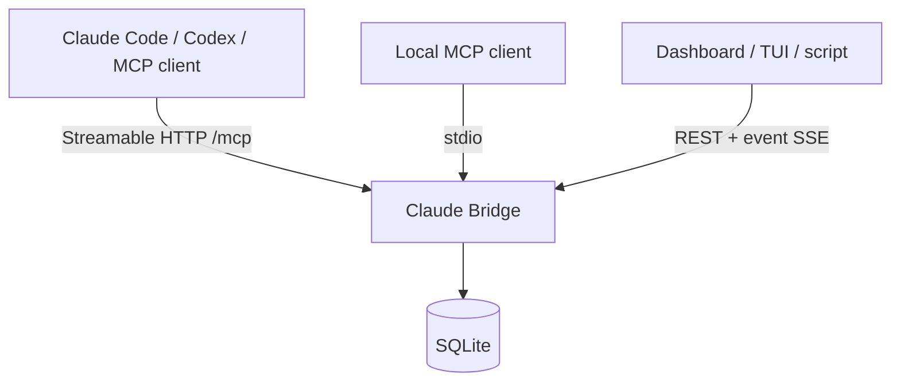

# Claude Bridge

<!-- mcp-name: io.github.constripacity/claude-code-bridge -->

**A local-first, cross-machine message bus for independent coding agents.**

[](https://github.com/constripacity/Claude-Bridge/actions/workflows/ci.yml)


Claude Bridge lets coding-agent sessions on different machines exchange
ordered messages through named channels. The relay is self-hosted, uses SQLite
by default, and exposes MCP, a small JSON API, a dashboard, and a terminal UI.

It does not call a model API and does not require agents to share a filesystem
or process. Claude Code motivated the project, but the core is MCP-based and is
not coupled to Anthropic.

> **Forward-build notice:** this source tree identifies as `1.2.0.dev1`. It is
> a development build beyond the latest stable PyPI release. Review the
> [changelog](https://github.com/constripacity/Claude-Bridge/blob/main/CHANGELOG.md)
> and [0.9-to-1.2 migration guide](https://github.com/constripacity/Claude-Bridge/blob/main/docs/MIGRATING-0.9-TO-1.2.md)
> before replacing a stable deployment.

## Why use it?

- Keep agents on Windows, macOS, Linux, or a remote host in their own sessions.
- Send work, results, review requests, and artifact references without remote
  shell access.
- Use durable history and consumer cursors to recover after a client restart.
- Retry sends safely with an idempotency key.
- Observe the same relay through MCP, a browser dashboard, the TUI, or REST.
- Run locally or across a private LAN/tailnet with an explicit security policy.

Claude Bridge is a transport, not an autonomous orchestrator. Receiving a
message never authorizes an agent to execute it.

## Transports

| Interface | Path or command | Purpose |
|---|---|---|
| MCP Streamable HTTP | `/mcp` | Recommended remote MCP transport |
| MCP stdio | `claude-bridge --stdio` | Local subprocess transport |
| Legacy MCP HTTP+SSE | `/sse` and `/messages/` | Existing configurations during migration |
| Channel event SSE | `/events/channel/<channel>` | Dashboard, TUI, and custom listeners; not MCP |
| JSON API | `/api/*` | Browser, scripts, and integrations |

The automated suite performs a real MCP SDK handshake against `/mcp`. Vendor
clients are not launched in CI. See the evidence-based
[compatibility matrix](https://github.com/constripacity/Claude-Bridge/blob/main/docs/COMPATIBILITY.md).

## Architecture


```mermaid
flowchart TB
    A["Claude Code / Codex / MCP client"] -->|"Streamable HTTP /mcp"| B["Claude Bridge"]
    C["Local MCP client"] -->|"stdio"| B
    D["Dashboard / TUI / script"] -->|"REST + event SSE"| B
    B --> E[("SQLite")]
```

Messages and live-notification records are committed to SQLite in one
transaction. HTTP processes poll that durable outbox (500 ms by default), so a
write from a separate stdio process is propagated to connected dashboard/TUI
event streams. Durable channel history remains authoritative across restarts.

## Install

```bash
python -m pip install claude-code-bridge
```

Install the terminal UI as well:

```bash
python -m pip install "claude-code-bridge[tui]"
```

The PyPI distribution is named `claude-code-bridge` because `claude-bridge`
was already assigned to an unrelated project. The command and Python package
remain `claude-bridge` and `claude_bridge`.

From a source checkout:

```bash
git clone https://github.com/constripacity/Claude-Bridge.git
cd Claude-Bridge
python -m pip install -e ".[dev]"
```

## Start safely

Local-only HTTP mode is the default:

```bash
claude-bridge
```

This listens on `127.0.0.1:8765`. Open `http://127.0.0.1:8765/` for the
dashboard or connect an MCP client to `http://127.0.0.1:8765/mcp`.

Local stdio mode does not open a network listener:

```bash
claude-bridge --stdio
```

### Cross-machine server

Network binding is deliberately fail-closed. Supply the address clients put in
their URL as a trusted host and require a token:

```bash
export CLAUDE_BRIDGE_AUTH_TOKEN="$(openssl rand -hex 32)"
claude-bridge \
  --host 0.0.0.0 \
  --trusted-host 100.64.0.10
```

Here `100.64.0.10` might be the server's tailnet address. A DNS deployment
would use a value such as `bridge.example.internal`. `--trusted-host` values
are hostnames or IP addresses, without a URL scheme or path, and the option is
repeatable.

Two independent checks are required:

1. `--trusted-host` controls which HTTP Host names are accepted; and
2. the Bearer token controls who can use protected endpoints.

For a deliberately unauthenticated private test network, replace the token
with `--allow-unauthenticated-network`. That is an explicit risk acceptance,
not the recommended production setup.

Use `--tls-cert` and `--tls-key`, an HTTPS reverse proxy, or an encrypted
overlay network before sending sensitive content across an untrusted network.
See the [security policy](https://github.com/constripacity/Claude-Bridge/blob/main/SECURITY.md)
for the complete trust model.

### Container

The official image also fails closed. A network deployment must provide its
trusted host and authentication policy:

```bash
export CLAUDE_BRIDGE_AUTH_TOKEN="$(openssl rand -hex 32)"
docker run --rm -p 8765:8765 \
  -v claude-bridge-data:/data \
  -e CLAUDE_BRIDGE_AUTH_TOKEN \
  -e CLAUDE_BRIDGE_TRUSTED_HOSTS="100.64.0.10" \
  ghcr.io/constripacity/claude-bridge:latest
```

The SQLite database is stored in `/data`. Release images use exact and
major/minor tags; `edge` tracks `main`.

## Connect a client

### Claude Code

Remote Streamable HTTP:

```bash
claude mcp add --transport http -s user claude-bridge \
  http://127.0.0.1:8765/mcp
```

Local stdio:

```bash
claude mcp add -s user claude-bridge -- claude-bridge --stdio
```

For a protected remote endpoint, attach the matching Authorization header
using the option supported by the installed Claude Code version. Legacy
configurations can continue to target `/sse` with `--transport sse` while they
migrate.

### Codex

Local stdio in `~/.codex/config.toml`:

```toml
[mcp_servers.claude_bridge]
command = "claude-bridge"
args = ["--stdio"]
```

Remote Streamable HTTP:

```toml
[mcp_servers.claude_bridge]
url = "http://127.0.0.1:8765/mcp"
bearer_token_env_var = "CLAUDE_BRIDGE_AUTH_TOKEN"
```

These examples follow the transports each client documents. The repository's
CI verifies MCP protocol behavior, not a full vendor-client launch. See
[compatibility matrix](https://github.com/constripacity/Claude-Bridge/blob/main/docs/COMPATIBILITY.md)
before making support claims.

## MCP tools

| Tool | Purpose |
|---|---|
| `bridge_send` | Send legacy text or a protocol-v1 message; supports idempotent retries |
| `bridge_receive` | Read a bounded page using a message cursor or durable consumer cursor |
| `bridge_wait` | Wait up to 55 seconds for new messages without rapid polling |
| `bridge_ack` | Monotonically advance a consumer's channel-scoped cursor |
| `bridge_channels` | List active channels and counts |
| `bridge_ping` | Check bridge health and capabilities |
| `bridge_status` | Summarize recent activity across channels |
| `bridge_clear` | Delete every message in one channel |

Tool results include structured data for clients that support MCP structured
content and a readable text representation for compatibility.

### Reliable task/result example

The orchestrator sends a structured task with a stable retry key:

```text
bridge_send(
  channel="payments:worker",
  sender="windows-orchestrator",
  idempotency_key="job-802-task",
  message={
    "schema_version": 1,
    "type": "task",
    "content": {"action": "run_tests", "target": "payments"},
    "thread_id": "payments-42",
    "correlation_id": "job-802"
  }
)
```

The worker waits using its persisted consumer identity:

```text
bridge_wait(
  channel="payments:worker",
  consumer_id="mac-worker",
  timeout_seconds=20
)
```

After applying the task successfully, it advances its cursor:

```text
bridge_ack(
  channel="payments:worker",
  consumer_id="mac-worker",
  message_id="<processed-message-id>"
)
```

It can then send a result to a return channel using the same `thread_id` and
`correlation_id`. Acknowledgement supplies at-least-once processing semantics;
it does not make arbitrary external side effects exactly once.

The complete envelope, retry, cursor, and retention contract is documented in
[protocol reference](https://github.com/constripacity/Claude-Bridge/blob/main/docs/PROTOCOL.md).

## Channels

Channels are created on first write. A readable convention is
`<project>:<purpose>`:

```text
payments:orchestrator
payments:worker
payments:events
payments:review
general:status
```

A channel name is routing, not authorization. In the current shared-token
model, any authorized client can read, write, or clear any channel.

## Dashboard, TUI, and JSON API

The dashboard is served at `/` unless `--no-dashboard` is used. It consumes the
JSON API and the per-channel event stream. Its React application, fonts, and
other runtime assets are bundled with the package, so loading the dashboard
does not contact a third-party CDN. A restrictive Content Security Policy is
applied to the static application.

Run the TUI:

```bash
python -m claude_bridge.tui
python -m claude_bridge.tui \
  --url http://100.64.0.10:8765 \
  --sender mac
```

The TUI reads `CLAUDE_BRIDGE_AUTH_TOKEN` from the environment, keeping the
secret out of the process command line.

Core HTTP endpoints:

| Endpoint | Purpose |
|---|---|
| `GET /status` | Minimal unauthenticated health check |
| `GET /api/state` | Channel counts, senders, version, and uptime |
| `GET /api/messages?channel=X&since_id=Y&limit=N` | Bounded channel history |
| `GET /api/messages/{id}` | One message detail |
| `GET /api/wait?channel=X&consumer_id=Y` | Bounded long poll using a consumer or message cursor |
| `POST /api/send` | Send legacy text or a protocol-v1 message, with optional idempotency |
| `POST /api/ack` | Advance one durable consumer cursor |
| `POST /api/clear` | Clear one channel |
| `GET`, `POST`, `DELETE /api/session` | Inspect, create, or revoke an opaque dashboard session |
| `GET /api/audit?limit=N` | Recent audit events when enabled |
| `GET /events/channel/<channel>` | Live event stream with bounded replay |

The event stream can drop a slow subscriber after its buffer fills; durable
history remains authoritative. Reconnect with the last message ID and honor
`cursor_stale` or `replay_truncated` by fetching history explicitly.

## Authentication and browser boundaries

Set `CLAUDE_BRIDGE_AUTH_TOKEN`, `--auth-token-file`, or `--auth-token`. The
literal CLI form can appear in process listings; the environment variable or a
permission-restricted file is preferred.

When enabled, protected REST, MCP, and event endpoints require:

```text
Authorization: Bearer <token>
```

`/status` remains public and deliberately contains minimal information. The
static dashboard shell may be reachable, but protected data APIs still require
the token.

Unsafe browser mutations are restricted by Origin, JSON endpoints require a
JSON media type, and Host headers are allowlisted. Extra browser origins are
configured independently with repeatable `--cors-origin` flags.

The dashboard submits the Bearer token once to `POST /api/session` and receives
a short-lived opaque `HttpOnly`, `SameSite=Strict` cookie. The master token is
not written to local storage or a URL. Event streams authenticate with that
cookie; `?token=` query authentication is rejected. Logging out revokes the
session, and a server restart invalidates all in-memory dashboard sessions.

## Configuration

| CLI/environment | Default | Purpose |
|---|---|---|
| `--host` | `127.0.0.1` | HTTP bind interface |
| `--port` | `8765` | HTTP port |
| `--db` / `CLAUDE_BRIDGE_DB` | `./claude-bridge.db` | SQLite path |
| `--trusted-host` / `CLAUDE_BRIDGE_TRUSTED_HOSTS` | loopback hosts | Accepted Host names/IPs |
| `--auth-token-file` / `CLAUDE_BRIDGE_AUTH_TOKEN` | unset | Shared Bearer authentication |
| `--allow-unauthenticated-network` | off | Explicit non-loopback auth bypass |
| `--cors-origin` / `CLAUDE_BRIDGE_CORS_ORIGIN` | same-origin only | Additional browser origins, including another localhost port |
| `--tls-cert` + `--tls-key` | unset | Direct HTTPS listener |
| `--retention-days` / `CLAUDE_BRIDGE_RETENTION_DAYS` | `0` | Delete messages older than N days; `0` keeps them |
| `--audit-log` / `CLAUDE_BRIDGE_AUDIT_LOG` | off | Record security-relevant events |
| `CLAUDE_BRIDGE_AUDIT_RETENTION_DAYS` | `90` | Bound audit history |
| `CLAUDE_BRIDGE_SESSION_TTL_SECONDS` | `28800` | Opaque dashboard-session lifetime |
| `CLAUDE_BRIDGE_EVENT_POLL_MS` | `500` | Cross-process outbox polling interval |
| `CLAUDE_BRIDGE_EVENT_RETENTION_DAYS` | `7` | Retain delivered outbox records |
| `--no-dashboard` | off | Do not mount browser assets |
| `CLAUDE_BRIDGE_MAX_REQUEST_BYTES` | `262144` | Maximum HTTP request body |
| `CLAUDE_BRIDGE_MAX_MESSAGE_BYTES` | `131072` | Maximum encoded message |
| `CLAUDE_BRIDGE_MAX_SSE` | `100` | Total channel-event subscribers |
| `CLAUDE_BRIDGE_MAX_SSE_PER_CHANNEL` | `25` | Subscribers on one channel |
| `CLAUDE_BRIDGE_SSE_REPLAY_LIMIT` | `500` | Reconnect backlog cap |
| `CLAUDE_BRIDGE_STATELESS_HTTP` | off | Use stateless Streamable HTTP sessions |

CLI values take precedence where a matching flag exists. Invalid numeric or
boolean environment values fail during startup with a configuration error.

## Persistence and operational limits

- SQLite runs in WAL mode and is suitable for a personal or small-team relay.
- The server is not currently a multi-node or high-availability message broker.
- One HTTP worker plus cooperating stdio processes can share the WAL database;
  the durable outbox propagates their live events. This remains a small-scale
  SQLite design, not a multi-node or enterprise broker.
- Retention can invalidate old cursors. Important work products belong in a
  repository or artifact store, not only in bridge history.
- The shared Bearer token does not provide identity or per-channel permissions.
- No benchmark claim is made without a reproducible benchmark and environment.

The future operations and authorization milestones are in
[roadmap](https://github.com/constripacity/Claude-Bridge/blob/main/docs/ROADMAP.md).

## Development

```bash
python -m pip install -e ".[dev]"
ruff check claude_bridge tests
pytest -v
python -m build
```

CI tests Linux across Python 3.10–3.13 and runs current-version smoke jobs on
Windows and macOS. The real-socket MCP test covers initialization, tool listing,
send, receive, wait, and acknowledgement through the official SDK. A separate
job builds the sdist and wheel, validates their metadata, installs each artifact
into a clean environment, and checks the CLI.

Read the [contribution guide](https://github.com/constripacity/Claude-Bridge/blob/main/CONTRIBUTING.md)
before proposing a new capability. For a vulnerability, use the private process
in the [security policy](https://github.com/constripacity/Claude-Bridge/blob/main/SECURITY.md),
not a public issue.

## Roadmap

The current sequence is:

1. `1.2` — secure Streamable HTTP, structured messages, idempotency, and durable
   consumers;
2. `1.3` — native client diagnostics and an experimental Claude Channels
   companion;
3. `1.4` — individual identities, scopes, ACLs, quotas, and token rotation;
4. `1.5` — observability, operational tooling, and an optional scalable
   backend; and
5. `2.0` — federation and an optional A2A adapter if real usage demands them.

Each milestone and its non-goals are defined in the
[roadmap](https://github.com/constripacity/Claude-Bridge/blob/main/docs/ROADMAP.md).

## License

MIT — see the [license](https://github.com/constripacity/Claude-Bridge/blob/main/LICENSE).

Founded and maintained by **Constripacity**.
